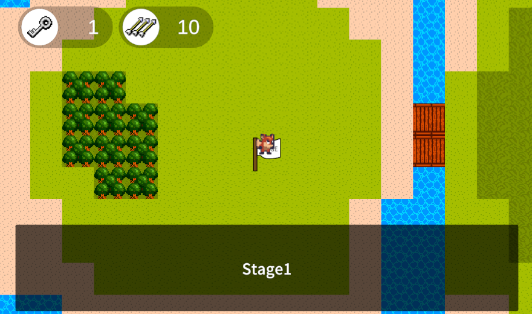
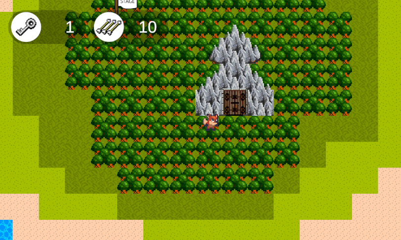

 # JewelryHunter_World

 ##プログラムの場所
*Assets/Scriptsフォルダ…各スクリプト

## 作品の概要

### 作品について
unityで2Dゲームを学ぶにあたって、基本的な機能が網羅されている作品としました。横スクロールのステージと、見下ろし型のワールドマップを組み合わせています。
アクションゲームとしての楽しさが出るようにギミックをちりばめています。

## 作品の遊び方
タイトル→ワールドマップ→ロックのかかっていないステージ選択→ステージの中の鍵を探す→ワールドマップでステージのロックを解除して攻略
全部のステージを攻略したらボスステージ解禁→ボス撃破でゲームクリア

ワールドマップ
* 移動：WASDキー/矢印キー
* 決定：スペースキー/エンターキー

ステージ中
* 移動：ADキー/左右キー
* 矢を打つ：エンターキー
* ジャンプ：スペースキー

## 使用技術・ツール
* unity(6000.3.5f2)
* VisualStudio community2026 C#
* SourceTree
* 利用アセット：SunnyLand ArtWork.
* 参考書籍：たのしい2Dゲームの作り方(第3版) 翔泳社

## 制作期間
* 2026/2/2～2026/2/27

## 制作のポイント
2Dサイドのアクションと、見下ろし方のトップビューという異なるゲーム性のパートを矛盾が無いようにブレンドしています。
* アクションパート専用のGameManagerとPlayerスクリプト
* ワールドマップ専用のUIとPlayerスクリプト
* 共通するGameManagerやSoundManager
共通する部分と、完全にスクリプトを分ける部分と切り分けて作りました。

## セーブ機能の実装
ゲームの一定の状態をセーブして続きから遊べるように配慮しました。
PlayerPrefsとJCONを活用しています。

### ボス戦でのアイテム自動補充
矢の残数がなくなるとシーン上の特定のアイテムのタグ情報を配列に取得し、ランダムなindexに補充の矢を置くようにしました。Find系命令でゲームに負荷がかからないように工夫してスクリプトを書きました。

## 課題
今回はunityの技術を学ぶための作品として書籍を参考にして作り始めました。書籍の内容と自分のアレンジとをつぎはぎしたため、ゲームステータスのコントロールやUIのコントロールが無理やりな部分がありました。

   今回のゲームをもっと面白くする議題
   * Enemyの種類を増やす
   * チャージショットが打てるようにする
   * 探索・収集要素を盛り込んでステージをリピートする楽しさを作る
   * ストーリーパートを導入して没入感を高める
   * ステージ地形の種類を増やし2Dマップの面白さの向上

## 所感
1つ1つのスクリプトを理解するのに大変でしたが、基礎構築ができたのでゲームをブラッシュアップしたい気持ちや次のゲームを作る気持ちが出ました。
